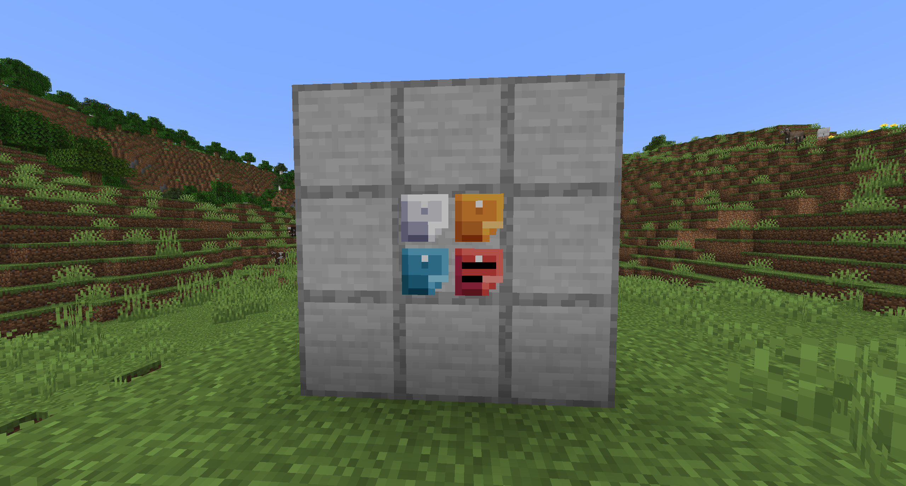
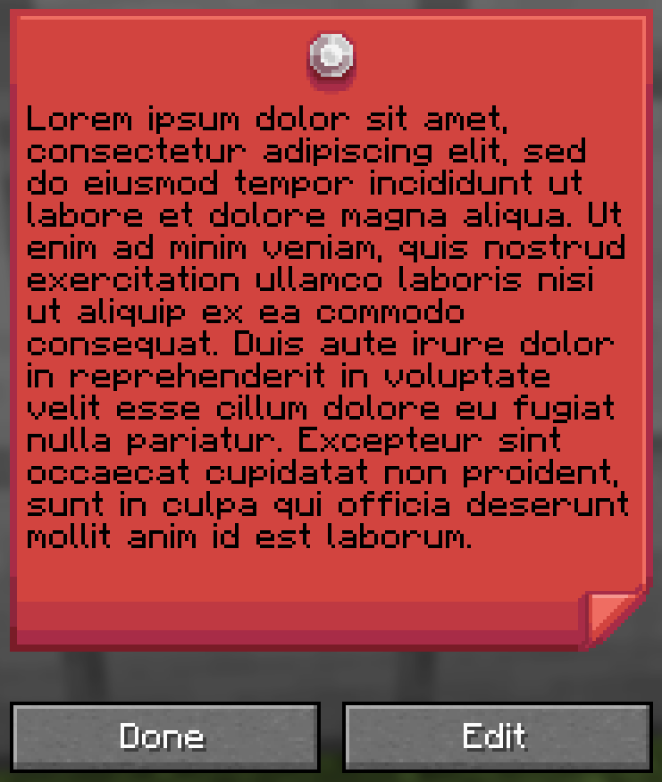
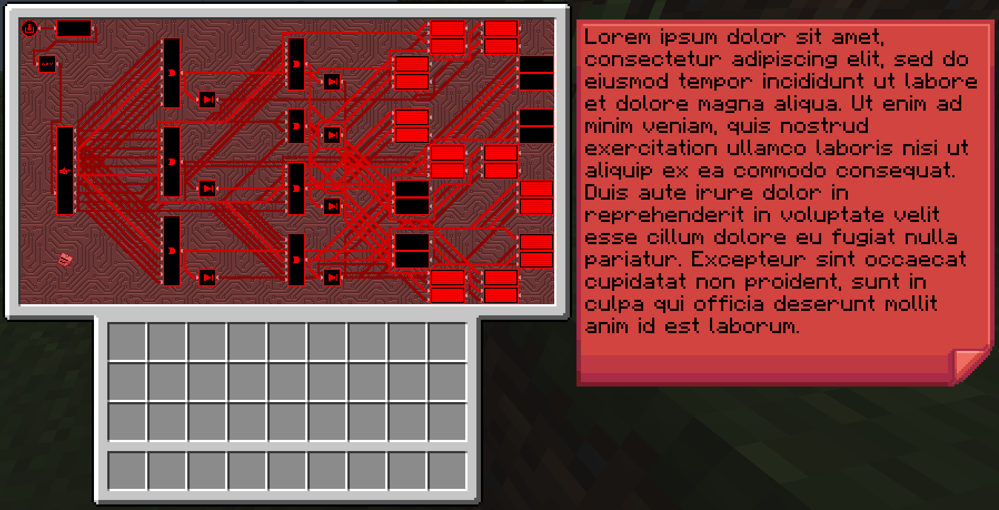

# Little Big Redstone

This mod adds a new block called the Microchip that allows you to put together complex logic that interfaces with
redstone and item/fluid/energy storages!

For any questions, please ask in the `#little-big-redstone` channel on [my discord](https://discord.gg/vNaqDzSNaB).

***

All items come in all dye colors to allow for personalization, expression, and organization!

<!-- Direct image link:  -->

### Microchips

Mirochips are blocks that can have logic placed in their GUI in many different arrangements. Redstone bits are used 
to create connections between logic components in the GUI. All logic components have tooltips that describe what 
their functions are.

Below is a demonstration of how complex logic can get inside of the Microchip GUI. This is a seven segment display 
created by bigfoott. While this microchip does not have a designated output, you can place any number of inputs and 
outputs as you may need.

<!-- Direct image link:  -->

Logic can be colored separately from the color of the microchip by interacting with it in the gui with dye. You can 
remove the color from components with either snowballs (consumed) or a water bucket (not consumed).

### Logic Arrays

Logic arrays are items that can store redstone bits and logic components. The contents can be opened both while in 
hand, or while in the GUI of a Microchip for ease of access.

### Floppy Disks

Floppy disks are items that allow you to copy and store logic arrangements (and wire connections) from microchips. 
You then can take the stored circuit and install it into another microchip, however it does require that the items 
be present in your inventory for you to do so.

### Sticky Notes

Sticky notes are items that you can place into the world similar to item frames. On each face of a block, you can 
place 4 sticky notes with any combination of colors and rotations. The text on sticky notes can also be colored by 
interacting with dye (or with snowballs or water buckets to wash the color out) on a sticky note. Sticky notes retain 
their contents and colors when broken and placed.

<!-- Direct image link:  -->

When placed, you can interact with a sticky note to view what is written on it, or write your own text. Sticky 
notes support very rudimentary markdown formatting.

<!-- Direct image link:  -->

Sticky notes may also be placed inside of microchips to allow you to put notes in your logic.

<!-- Direct image link:  -->

***

All art (with exception of the logic components, wires, and redstone bit) are made by Facu.